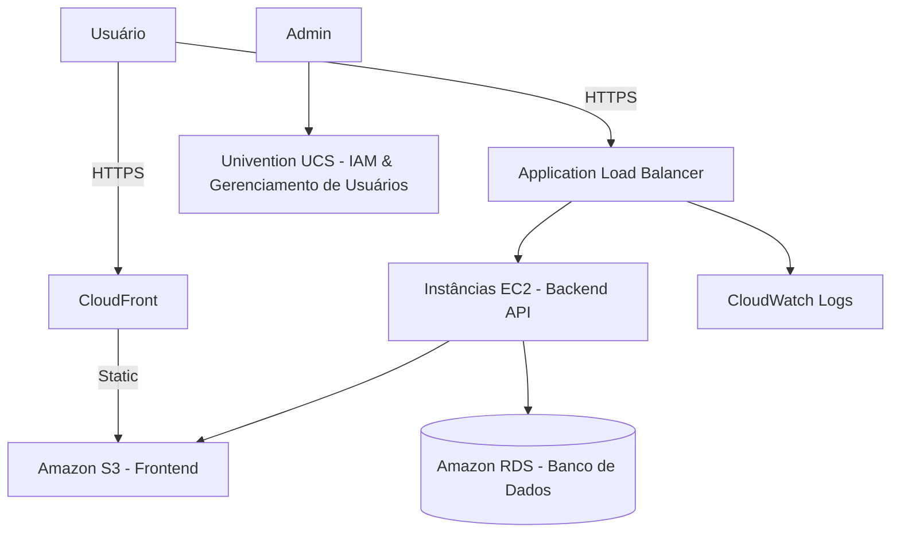

# 💊 Plataforma Virtual de Farmácia na AWS


## 📋 Descrição

Este projeto apresenta uma plataforma fictícia de farmácia, implantada na AWS com uso de infraestrutura como código, aplicação web fullstack e boas práticas de arquitetura em nuvem.

## 🎯 Objetivos

- Criar uma arquitetura escalável e segura para uma farmácia online
- Implantar uma aplicação React + Node.js + PostgreSQL
- Gerenciar usuários e segurança com IAM, VPC, UCS
- Automatizar o deploy com Terraform

## 🧱 Arquitetura



## 🚀 Como executar

### 🔧 1. Provisionar a infraestrutura

```bash
cd infra
terraform init
terraform apply
```

### 🖥 2. Subir o backend

```bash
cd backend
npm install
node server.js
```

### 🌐 3. Publicar o frontend

```bash
cd frontend
npm install
npm run build
aws s3 sync build/ s3://<nome-do-bucket>
```

## 🔐 Segurança

- IAM Roles e Security Groups
- Secrets Manager para variáveis sensíveis
- Auto Scaling e Balanceamento de carga com Health Checks

## 👤 Gerenciamento de Usuários

- Integração com Univention UCS
- Suporte a RSAT e GPOs básicas

## 📁 Estrutura

- `infra/`: Infraestrutura com Terraform
- `backend/`: API RESTful Node.js
- `frontend/`: Interface React

## 📄 Licença

Distribuído sob licença MIT. Veja `LICENSE` para mais detalhes.

---

> Projeto educacional para fins de estudo em computação em nuvem com AWS.
